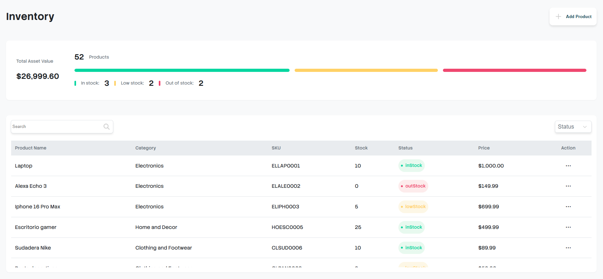

# 🏪 Store Inventory Dashboard

Inventory Dashboard to manage products, stock and categories with real-time UI updates.

---

## 🚀 Live Demo

🔗 You can try the application here:
👉 

---

## 🖼️ Preview



---

## 🚀 Features

- Add, edit and delete products (CRUD)
- Filter products by stock status (In Stock, Low Stock, Out of Stock)
- Search products by name or SKU
- Real-time dashboard updates
- Stock summary and dynamic progress bars
- Local storage persistence
- Interactive UI with modals and animations
- Empty states and user feedback messages

---

## 🛠️ Tech Stack

- HTML5
- CSS3 (Modular structure)
- JavaScript (Vanilla JS, ES Modules)

---

## 📂 Project Structure

```
📁 project-root
├── 📁 assets
│   └── 📁 icons
├── 📁 css
│   ├── 📁 base
│   │   ├── resets.css
│   │   └── variables.css
│   ├── 📁 components
│   │   ├── buttons.css
│   │   ├── card.css
│   │   ├── filters.css
│   │   ├── icons.css
│   │   ├── inputs.css
│   │   ├── modal.css
│   │   ├── progressbar.css
│   │   ├── searchbar.css
│   │   └── table.css
│   ├── 📁 layout
│   │   ├── container.css
│   │   └── header.css
│   ├── 📁 utilities
│   │   └── helpers.css
│   └── style.css
├── 📁 js
│   ├── app.js
│   ├── inventoryManager.js
│   ├── product.js
│   ├── storage.js
│   └── ui.js
├── 📁 public
│   └── 📁 previews
│       └── dashboard.png
├── index.html
└── README.md
```

---

## 📚 What I Learned

- Managing application state in JavaScript
- Separating logic and UI responsibilities
- DOM manipulation and dynamic rendering
- Handling user events and interactions
- Structuring scalable frontend projects
- Working with localStorage for persistence
- Improving UX with feedback and animations

---

## 🔮 Future Improvements

- Pagination system
- API integration (backend connection)
- Authentication system
- Refactor to a framework (React or similar)
- Better state management

---

## 👨‍💻 Author

Developed by **Raúl Limón**  
Frontend Developer in progress 🚀

- GitHub: [RaulLimon3](https://github.com/RaulLimon3)  
- LinkedIn: https://www.linkedin.com/in/raul-limon-garcia/